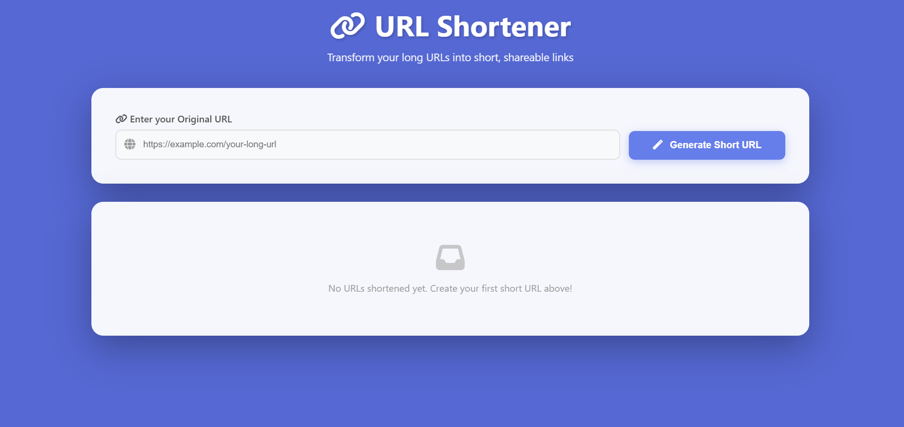
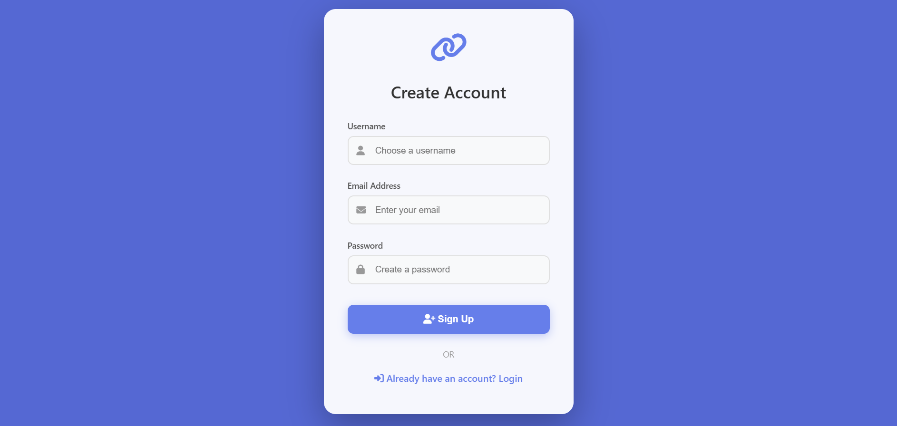
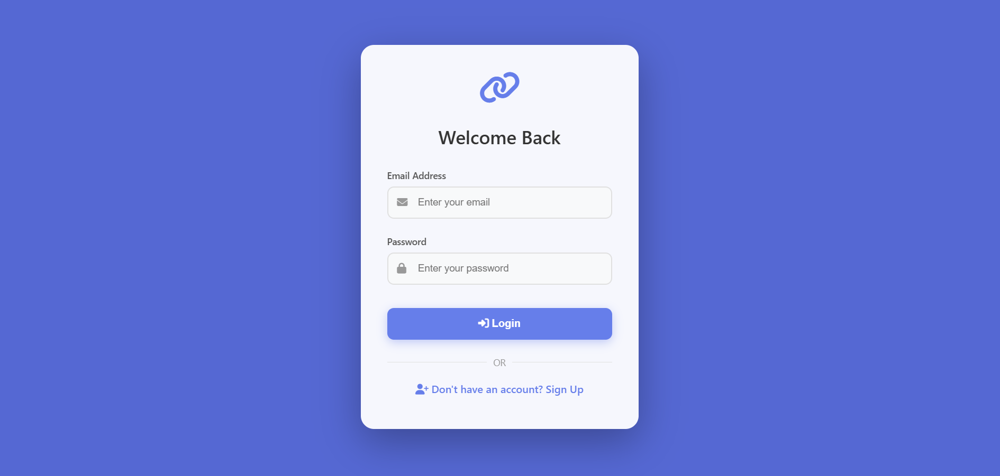

# 🔗 Linkify — URL Shortener

<p align="center">
	<a href="https://linkify-8r5h.onrender.com" target="_blank">
		
	</a>
	
	
	
	
	
</p>

Linkify is a full-stack URL shortening app built with Node.js, Express, MongoDB, and EJS. It converts long URLs into short, shareable links with authentication and basic click analytics.

## 🌐 Live Demo

- 👉 **Live App:** [https://linkify-8r5h.onrender.com](https://linkify-8r5h.onrender.com)

## ✨ Key Features

- 🔐 JWT-based authentication (login/signup)
- 🎯 Short URL generation (NanoID/ShortID)
- 🔁 Fast redirects (`/:shortId`)
- 📊 Basic click analytics (stores visit timestamps)
- 🧭 Simple EJS UI (home, login, signup)
- 🔒 Protected routes for authenticated users

## 🧰 Tech Stack

- Backend: Node.js, Express
- Database: MongoDB, Mongoose
- Views: EJS
- Auth: JWT (stored in cookies)
- Utilities: cookie-parser, nanoid/shortid

## 📁 Project Structure

```
2_1Short_Url/
├── controllers/
├── middlewares/
├── models/
├── routes/
├── service/
├── views/
├── connect.js
├── index.js
├── .env
├── package.json
└── package-lock.json
```

## 📸 Preview

### 🏠 Main Page


### 🔐 Signup Page


### ⚙️ Login Page


## 🚀 Getting Started (Local)

1) Go to the project folder:

```bash
cd 2_1Short_Url
```

2) Install dependencies:

```bash
npm install
```

3) Create `.env` (don’t commit it):

You can copy from `.env.example` and update the values.

```env
MONGO_URI=mongodb://localhost:27017/shorturl
JWT_SECRET=your_super_secret_key
PORT=8001
```

4) Start MongoDB locally (if using local MongoDB):

```bash
net start MongoDB
```

5) Run the app:

```bash
npm run dev
```

Open: http://localhost:8001

## 🔑 Environment Variables

| Variable | Required | Description |
| --- | --- | --- |
| `MONGO_URI` | ✅ | MongoDB connection string (local or Atlas) |
| `JWT_SECRET` | ✅ | Secret used to sign JWT tokens |
| `PORT` | ❌ | Local port (Render provides `PORT` automatically) |

## 📌 API Routes (Quick Reference)

- `POST /user` — Signup
- `POST /user/login` — Login
- `POST /url` — Create short URL (protected)
- `GET /:shortId` — Redirect + store visit timestamp
- `GET /` — Homepage
- `GET /signup` — Signup page
- `GET /login` — Login page

## 🚢 Deploying on Render

1) Create a MongoDB Atlas cluster and copy the `mongodb+srv://...` connection string.

2) On Render → **New Web Service**:

- **Root Directory:** `2_1Short_Url`
- **Build Command:** `npm install`
- **Start Command:** `npm start`

3) Add environment variables on Render:

- `MONGO_URI` = your Atlas connection string
- `JWT_SECRET` = a strong secret
- `NODE_ENV` = `production` (recommended)

Note: don’t set `PORT` on Render — Render sets it automatically.

## 👨‍💻 Author

Built by Avinash.
